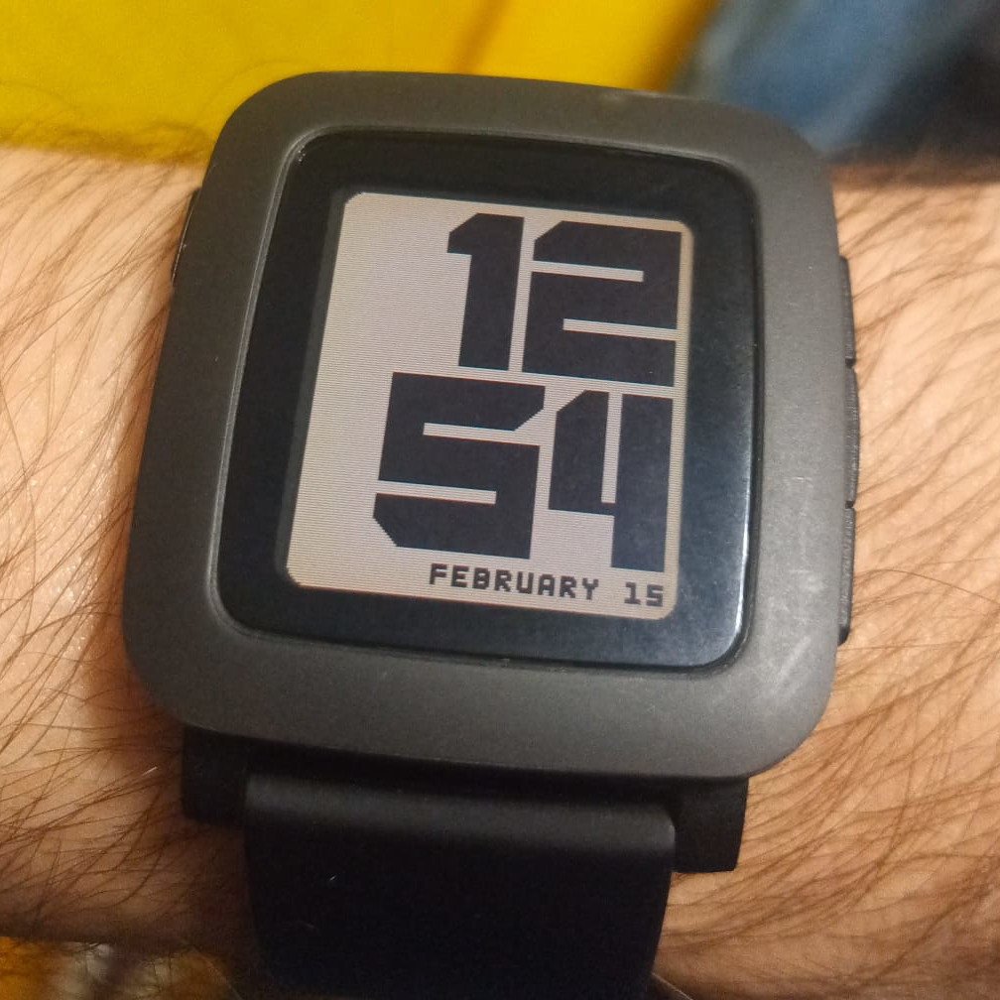
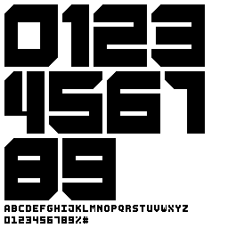
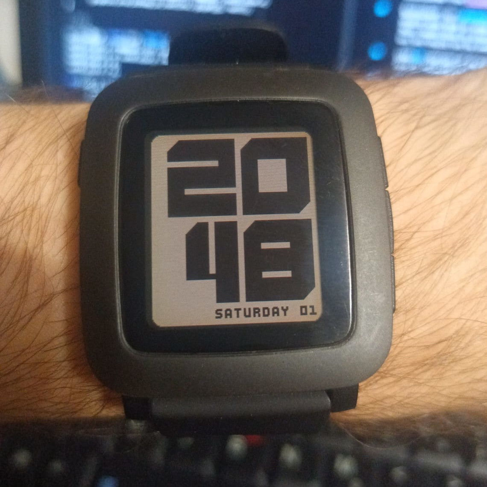
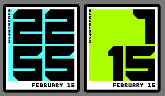
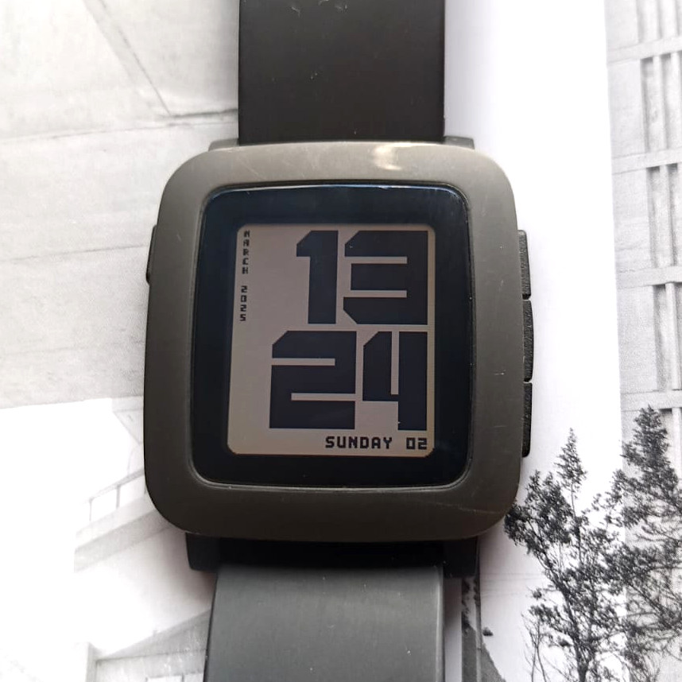
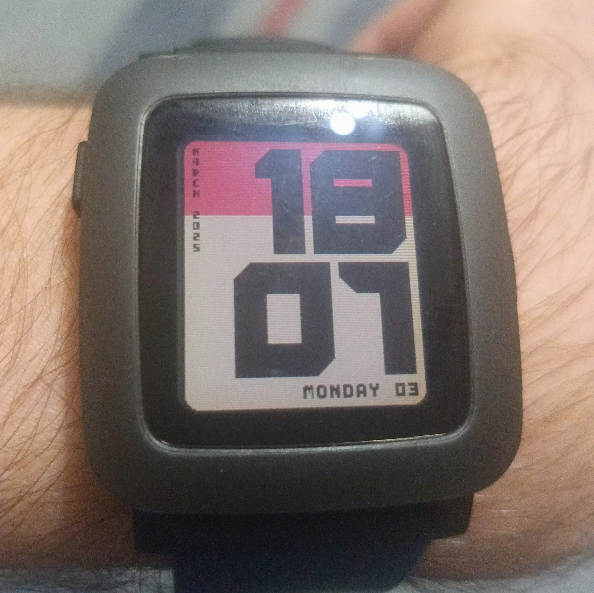

BRUTAL
======

Pebble watchface created during [Rebble][] [Hackathon #002][].

> This project has completely confiscated my life, darling.  My best
> work, I must admit.  Simple, elegant, yet bold.  You will die.


DEVLOG
======

2025.02.07 Fri 18:53 Ah shit, here we go again
----------------------------------------------

I'm going to prepare in advance, like last time.  Starting by setting
up development environment.  I'm not using premade VM.  I prefer to
have local setup.  According to official [Installing the Pebble SDK][]
guide I'm supposed to follow article [Writing a Pebble app in 2020][].
So I do.

But I'm already in trouble.  I need Python2 and I can't install it the
way it is done in the article.  I'm running Debian 12 Bookworm now.
This might be thought.

Ok, I have it.  Here is what I did:

	$ sudo ed /etc/apt/sources.list
	a
	deb http://archive.debian.org/debian/ stretch contrib main non-free
	.
	w
	$ sudo apt update
	$ sudo apt install python2.7

Then I completed the article with no problems.  The `pebble`
command now works.

	$ pebble --version
	Pebble Tool v4.6-rc2 (active SDK: v4.3)


2025.02.08 Sat 08:53 Help me source code, you're my only hope
-------------------------------------------------------------

I created a "Hello World" watchface with white background layer, time
and date printed using default fonts and setup for [Clay][] config.

I remember [Pebble development documentation][] being very helpful but
difficult to navigate.  This is because it's divided into specific
sections and text search input does not work.  So as usual it's just
better to grep the source code.  I couldn't find the `pebble.h` file
at first.  I was searching in files downloaded when installing Pebble
SDK.  But actually those are just tools that install the actual SDK.
By default Pebble SDK is places in `~/.pebble-sdk` and there I found
all header files.

Header files are nice but now we have full access to [PebbleOS][]
source code.  I can finally read implementations of `pebble.h` API
functions which makes programming much easier.  For example I can see
if passing a NULL pointer will cause trouble or it will be just
ignored.  With that I don't have to add extra conditions.

Anyhow, I'm more than ready for Hackathon.


2025.03.01 Sat 11:31 The time has come
--------------------------------------

First day of hackathon.  I will focus on design.  Like last time I'm
planning on testing ideas by making a simple watchface that display
single BMP image.  That way I can look at watchface on the watch and
not only in Gimp which makes a huge difference.

Yes this time I'm not using Inkscape, we are not friends anymore </3


2025.03.01 Sat 13:10 Done properly, design is a heroic act
----------------------------------------------------------

... done properly.

I was thinking about design for a month now.  Initially I wanted to
have 3 rows of big numbers.  I liked the idea of 9 digits because I
could display text PEBBLE, and 3 rows play very nice with the quick
view popup as only the last bottom row disappear.

```
    .-------.    .-------.    .-------. 
    |  1 2  |    |  P E  |    |  1 2  |
    |  3 4  |    |  B B  |    |__3_4__|
    |  5 6  |    |  L E  |    | popup |
    '-------'    '-------'    '-------' 
```

But no matter what I tried the design just didn't worked.  The number
where way to small, they where either stretched or a lot of the screen
space was not used.  This wasn't the look and feel I'm going for.

I want my font to feel bold and heavy.  Then I realized that to make
font feel bigger I need the contrast.  I have to put big numbers next
to very small font.  With that the feeling of size will be emphasized.



It took me long time to figure out the pixel perfect grid that would
fit 2 rows of big numbers that are build from repeated modular pieces
of the same size, and with third row for smaller moonspace font that
would fix perfectly from left to right and all margins between big and
small font and screen borders are the same.  So here is the recipe for
my perfect grid:

- 5px margin from screen borders which is as minimal as it can be to
  avoid getting too close to screen rounded corners
- 5px of space between first, second and third rows of text
- 70px of height for first 2 rows
- 5x5px blocks are used to build big numbers
- 5px of space between big number lines
- 8px of height for last row
- 134px of width in each row which is perfect for small monospace font
  in third row making it possible to fix exactly 17 characters that are
  6px wide and have 2px space between letters

It's perfect.  I had similar design at some point that looked almost
exactly the same.  But spaces between number, margins and letters where
very different.  With this new grid fonts feel more solid.  It's all
about the feeling.

> Don't think, feel! It is like a finger pointing away to the moon.
> Don't concentrate on the finger or you will miss all that heavenly
> glory.  Do you understand? - Bruce Lee


2025.03.01 Sat 16:32 Glyphs v1
------------------------------

I have first version of glyphs for both fonts.  The main big font has
only numbers and it's a proportional font.  The small monospace font
has uppercase letters, numbers and few special characters.



I'm not happy about few letters, mostly `M` and `W` but I want to do
some programming now.


2025.03.01 Sat 20:53 First tryyyyy!
-----------------------------------

Well, that was fast.  I just implemented the most basic version of
watchface using glyphs atlas.  Both fonts works as expected.



Time for break.  Here is a rough list of things to do next:

1. Redesign number `0`, it's not heavy enough.
2. Settings, custom background and foreground color, data format etc.
3. Background reflecting battery status.
4. Refactor, use multiple layers, avoid numbers.
5. Animations.
6. Icon.


2025.03.01 Sat 20:53 Now, it is balanced
----------------------------------------

After using this watchface I realized that empty space on the left is
problematic.  It's there on purpose, give a space to breath and it's a
result of decision to make main font non monospace.  Proportional
numbers are more readable.  But I can't explain that to everyone who
see this watchface.  The design must defend itself and right now to
regular user the left side looks strange.  Everything is on the right
side making it heavier.  I need balance.

I tried to add some text using small font but even tho it's small it
was too big for the little space that is on the left edge when clock
shows time like 22:22.  So I decided to try with another, even smaller
font.  And I love it.  This is truly a challenge in typography.  The
tiny font still has some unique character and it's possible to read,
but it's not there for everyday practical reasons.  It's there to
balance the design.




Now I'm satisfied with the composition.  I can proceed to work on
settings and refactor.


2025.03.03 Mon 18:11 Illusion of choice
---------------------------------------

I've made few improvements to fonts glyphs.  Code was heavily
refactored.  Watchface has now multiple layers.  But most importantly
I added configurations.  User can choose colors, date formats and
vibrations for Bluetooth disconnect event, Bluetooth connect event and
on each hour.

Another addition is the second background color showing battery
percent.  I tried many design ideas.  I rly liked my explorations of
different background color just under the big numbers.  But even tho I
liked that in Gimp, it didn't look good at all on watch.  So I ended
up with most basic solution.  I think that it looks excellent.




2025.03.03 Mon 18:59 I lied!
----------------------------

The battery level percent as background color was a short lived
feature.  No matter what color combination I tried I wasn't super
happy about it.  And the dithering on BW displays was messing with the
small fonts.  I tried to add background and border to those small
fonts to solve this issue but then watchface looked super ugly.

With that, I decided to terminate this feature.  But it will be back
as text in either left or bottom text area.


[Rebble]: http://rebble.io/
[Hackathon #002]: https://rebble.io/hackathon-002/
[Installing the Pebble SDK]: https://help.rebble.io/sdk/
[Writing a Pebble app in 2020]: https://willow.systems/blog/pebble-sdk-installation-guide/
[Pebble development documentation]: https://developer.rebble.io/developer.pebble.com/index.html
[Clay]: https://github.com/pebble/clay
[PebbleOS]: https://github.com/google/Pebble
